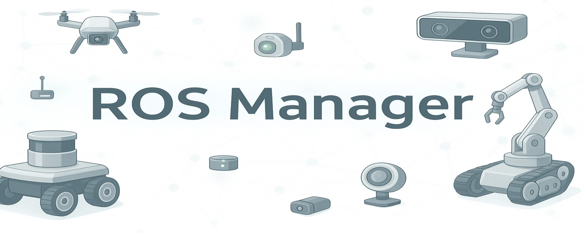
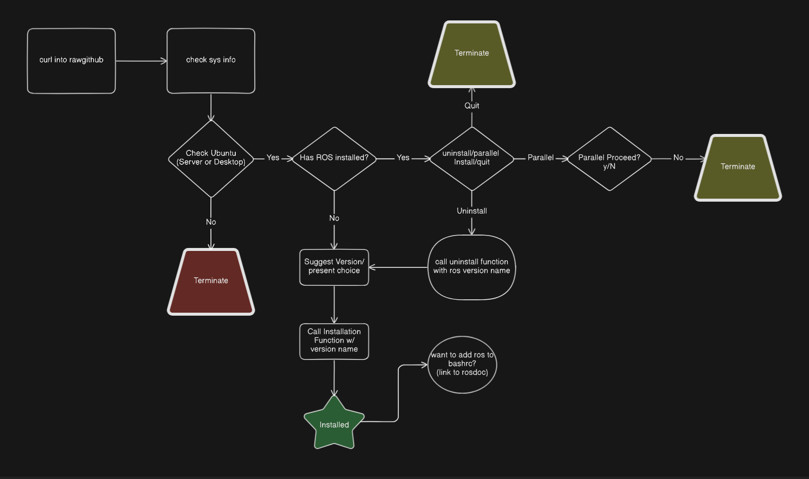

<p align="center">
  
</p>

<p align="center">
  <a href="https://github.com/koustavbetal/ros_manager">
    
  </a>
  <a href="https://github.com/koustavbetal/ros_manager/issues">
    
  </a>
  <a href="LICENSE">
    
  </a>
</p>


# ROS Manager

A hassle-free, one-liner installer & uninstaller for any ROS 2 version.  
Built for Raspberry Pi, server setups, and developers who just want to get it done.

## Features
- One-liner **install or uninstall** for ROS 2.
- Detects **OS, display manager**, and peripheral configurations.
- Prevents **parallel ROS installs** to avoid path conflicts.
- Includes **developer tools** optionally.
- Offers a **guided flow** for beginners and CLI flags for advanced users.

## Usage
```
bash <(curl -sSL bit.ly/ros-manager)
```
##### or
```
bash <(curl -sSL https://raw.githubusercontent.com/koustavbetal/ros_manager/main/rosinstaller.bash)
```

The Command Runs the Whole Script, **Recommended for New Developers^**.

**For Intermediate Users**, there are some Arguments you can use:
## Options
```
-v, --version [command]         Set ROS version [humble | iron | jazzy | rolling | kilted]
-f, --force [command]           Force install type [desktop | server]
-d, --dev                       Whether to Download ros-dev-tools or not
-h, --help                      Show this help message
```
## Example
```
bash <(curl -sSL https://raw.githubusercontent.com/koustavbetal/ros_manager/main/rosinstaller.bash) -v rolling -f desktop -d
```

### Flow Chart
<p align="center">
  <picture>
    
  </picture>
</p>

### Disclaimer
This Script is created keeping Beginner to Intermadiate user in mind, and for Professional Users this may not be the Best Solution.
^Beginners try to understand the basic concepts of Bash(linux Terminal) and ROS CLI commands first, to become a developer, not the user.
